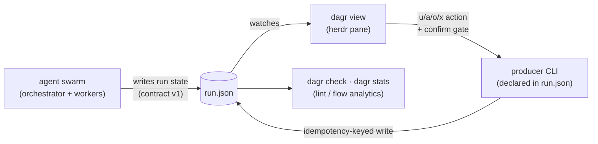

# herdr-dagr

Your agent swarm as a live DAG, in a [herdr](https://herdr.dev) pane.


> *Dagr* is the Norse personification of day: he rides across the sky once
> per cycle and illuminates everything below. Also, it's a DAG. With herdr's r.

## FAQ for humans

### What does this do?

It helps you manage and track agentic workflows involving 5+ agents or steps.

### How does it do it?

Your plan is a [DAG](https://en.wikipedia.org/wiki/Directed_acyclic_graph),
and your agents keep it current as they work. You watch it live in a pane,
and click any row to see who ran it, how long it took, and whether anyone
actually checked the result.

### What if I have more questions?

Ask your agent to read this README. Feeling lazy? Copy this prompt:

```
Read https://raw.githubusercontent.com/aemrebarut/herdr-dagr/main/README.md
and tell me what it does and whether it fits the way I run agents.
```

### No more questions, how do I get this?

```sh
command -v cargo || curl --proto '=https' --tlsv1.2 -sSf https://sh.rustup.rs | sh   # dagr builds from source, so it needs cargo
herdr plugin install aemrebarut/herdr-dagr                                           # the pane
npx skills add aemrebarut/herdr-dagr --skill dagr-producer -g                        # teach your agent to feed it
```

The last command is what makes the pane useful: it installs the producer
skill, which teaches your agent to write the run file. Nothing is written
into your agent unless you run it yourself.

Then open the pane from inside herdr:

```sh
herdr plugin action invoke open-dagr --plugin herdr-dagr
```

There is one action per side (`open-dagr-right`, `-down`, `-up`,
`-left`), so bind the one you want to a key and it always opens there:
see [Install](#install).

---

# The long version

## The pain point

You kick off a multi-agent run and lose the plot in minutes. Run state
is a JSON file or a status block, so you end up asking the orchestrator
"where are we?" and trusting the answer. You can't see which attempt is
actually running, what got sent back and why, what a gate is waiting
on, or what a retry loop is about to spawn. And when an agent says
"done", nothing tells you whether anyone checked.

## What dagr does

- **Shows the whole run at a glance.** Every task, attempt, gate, and
  loop, one line per attempt, drawn like `git log --graph`.
- **Keeps history honest.** A retry is a new row with a recorded cause
  (who sent it back, why). Nothing moves backward or repaints.
- **Separates "the agent said done" from "verified".** Every completion
  carries an evidence tier: `◆ verified · ◇ reported · ≈ heuristic ·
  ! asserted`.
- **Shows the future, marked as future.** Work a loop policy will emit
  is drawn in dotted ink, declared by the producer, never guessed by
  the renderer.
- **Lets you act from the pane.** Unblock, answer, accept, reject:
  each goes through a confirm gate showing the exact command, then
  calls a CLI the producer itself declared.

It's terminal-native 256-color ANSI, a single Rust binary, no runtime
interpreter.

## How to use it

Install the producer skill into your agent. It teaches any agent to
write and maintain the run file:

```sh
npx skills add aemrebarut/herdr-dagr --skill dagr-producer -g
```

For an agent without a skill system, paste the file into its
instructions instead. `dagr --skill` prints the copy bundled with your
binary, and [`skills/dagr-producer/SKILL.md`](skills/dagr-producer/SKILL.md)
is the same file here. Nothing is installed into your agent unless you
run that command yourself.

Then describe what your workflow should look like: review loops,
parallel lanes, gates, whatever you want. The agent maintains the run
file, the pane picks it up live, and you can iterate on the design with
them mid-run. The [selfrun demo](demos/selfrun/) is a run file produced
exactly this way, by an agent onboarded with only the skill.

## How it works

Your orchestrator (or any agent, onboarded with the shipped
[producer skill](skills/dagr-producer/SKILL.md)) maintains `run.json`
against a frozen contract, [`CONTRACT.md`](CONTRACT.md). `dagr` watches
the file and draws it. It never writes run state; whoever produces the
data owns it, and pane actions go to the producer's own CLI.



The contract is the load-bearing part: it can express the task/attempt
split, dependency promotion, typed loop policies, evidence tiers, and
liveness. Anything that wants to be drawn has to say what actually
happened, in a schema that can't blur "the agent said done" into
"done."

## The grammar in one screen

```
├─● L3 contract freeze        done ◆ verified   12m
├─✗ L4·a1 impl: gate schema   sent back        10m  builder-2  ✗ operator "err paths untested"
├↩● L4·a2 impl: gate schema   done ◇ reported   7m  builder-2
├─◐ L5 impl: renderer core    working          14m  builder-1
│ ╰┄○ L5r review              (future: on done)
■ G2 integration gate         waits L5r        ← L4✓ L5◐ L6✓
```

Gate rows carry fan-in chips (`← L4✓ L5◐ L6✓`) with per-input live
state; a blocked gate names its blocker. Moving the cursor unrolls
fan-in and policy trees and highlights the edges that justify the
selected row.

## Layout

One responsive pane, two established terminal idioms:

- **At ~146 columns and up** (the screenshot above): trace left,
  attention queue and focus card right; cursor movement live-updates
  the card. lazygit's grammar.
- **Below that**: full-width trace with detail docked below, including
  the provenance event tail. tig's grammar.


Both screenshots are real renderer output, regenerable with
[`scripts/snapshot-svg.py`](scripts/snapshot-svg.py):
`dagr view samples/run.json --snapshot --width 150 | scripts/snapshot-svg.py out.svg`.

## Navigation

The basics: `j/k` move (`g/G` jump to the ends, `ctrl-d/u` half-page),
`tab` cycles the attention queue, `enter` focuses the selected
attempt's herdr pane, `u/a/o/x` invoke the producer's declared
unblock/answer/accept/reject actions, `r` reload, `?` help, `q` quit.

Big runs get noisy, so the tree folds and zooms. `←` folds the branch
under the cursor down to one row with a `▸ n hidden` chip; the chip
keeps the counts that matter (blocked, lost, review), so folding never
buries an alarm. `→` unfolds, and on an open branch it zooms: the
subtree takes over the pane with a breadcrumb up top, and anything
outside that still needs eyes shows as a `+n need eyes outside`
counter, so zooming can't hide trouble either. `z` folds everything
that has settled, in one press. `esc` backs out of help, picker,
search, and zoom before it ever quits.

Finding things is quick too: `f` opens a file picker that lists your
recent runs first and scans nearby folders in the background, so
switching runs is a few keystrokes, not a filesystem crawl. `/` filters
rows by id, name, or agent as you type, `n/N` walk the matches, and `y`
copies the selected row id to your clipboard.

The mouse works too: click a trace row or a queue item to select it,
click a `▸` chip to unfold it, double-click a row to zoom into it,
scroll to move the cursor, and drag across anything to select text,
which lands on your clipboard when you let go (same as herdr, including
the argv inside a confirm gate). Actions stay keyboard-only on purpose;
a stray click can't confirm anything.

## Install

```sh
herdr plugin install aemrebarut/herdr-dagr   # builds via scripts/build.sh (cargo required)
herdr plugin action invoke open-dagr --plugin herdr-dagr
npx skills add aemrebarut/herdr-dagr --skill dagr-producer -g   # teach your agent to feed it
```

Or from a clone, `herdr plugin link .` at the repo root.

Installing the plugin gives you the pane. The skill is what gives you
something to draw, and it is a separate opt-in command: nothing writes
into your agent's config on your behalf. See
[How to use it](#how-to-use-it).

Bind it to a key in `~/.config/herdr/config.toml`:

```toml
[[keys.command]]
key = "prefix+d"
type = "plugin_action"
command = "herdr-dagr.open-dagr"
description = "open dagr run DAG in split"
```

That opens it to the right. Want it somewhere else? Bind
`open-dagr-down`, `open-dagr-up`, `open-dagr-left`, or
`open-dagr-right` instead, one key per side.

Or standalone, without herdr:

```sh
cargo build --release --locked
export PATH="$PWD/target/release:$PATH"   # demo docs assume dagr on PATH
export DAGR_RUN=samples/run.json
dagr view                             # interactive; --snapshot for capture
dagr check samples/run.json --strict
dagr stats samples/run.json
dagr --skill                          # the producer skill, as shipped
```

`cargo` is the only build requirement.

## Repo layout

- [`CONTRACT.md`](CONTRACT.md): the run-state contract, frozen v1,
  plus the §9 confirm-gated actions extension.
- [`src/`](src/): the `dagr` binary (Rust; serde + crossterm +
  unicode-width). `dagr check` lints a run file against the contract
  (`--json` for machine output, `--strict` to fail on warnings);
  `dagr view` is the pane (interactive watch mode, `--snapshot` for CI
  capture); `dagr stats` reports flow analytics (age, WIP, rework,
  critical path, naive ETA) over per-attempt timestamps.
- [`herdr-plugin.toml`](herdr-plugin.toml): the plugin manifest.
- [`samples/run.json`](samples/run.json): canonical contract v1 sample.
  [`samples/states.json`](samples/states.json): the whole state machine
  as data (every task/attempt state, all four evidence tiers), the
  renderer's regression fixture.
- [`demos/`](demos/): `selfrun/` (this repo's own development as a run
  file, produced by an agent onboarded with only the producer skill)
  and `actions/` (the confirm-gated send-back loop, with a reference
  producer CLI).
- [`skills/dagr-producer/`](skills/dagr-producer/SKILL.md): the skill
  that teaches any agent to set up and maintain a run graph against the
  contract, looping on `dagr check` for feedback. Install it with
  `npx skills add aemrebarut/herdr-dagr --skill dagr-producer -g`, or
  print the bundled copy with `dagr --skill`. Its `examples/` are held
  strict-clean by the test suite.
- [`assets/`](assets/): the README screenshots, generated from
  `samples/run.json` by [`scripts/snapshot-svg.py`](scripts/snapshot-svg.py).

## Status

**v0.1.** Contract frozen at v1. The pane renders the full grammar at
any width without crashing and stays readable down to about 34 columns.
The producer skill onboards a fresh agent to a run file that is
strict-clean on its first write and matches the ground truth it models;
the selfrun demo ships the receipts, because a clean-but-wrong document
is this project's core failure class. The action loop drives a real
send-back and new attempt entirely from the pane. Every milestone was
independently dual-reviewed by two model families, all findings
addressed. The selfrun demo is an honest mid-flight snapshot: its
release-milestone task records the final review round as planned
futures, since the file predates the cut it models (see
[`demos/selfrun/README.md`](demos/selfrun/README.md)).

## License

Licensed under either of [Apache License, Version 2.0](LICENSE-APACHE)
or [MIT license](LICENSE-MIT) at your option. Unless you explicitly
state otherwise, any contribution intentionally submitted for inclusion
in this work by you, as defined in the Apache-2.0 license, shall be
dual-licensed as above, without any additional terms or conditions.
