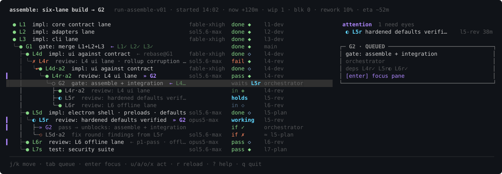
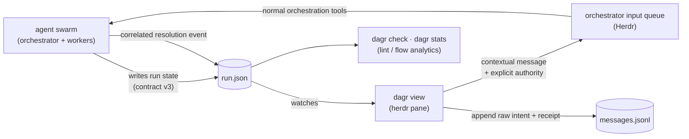
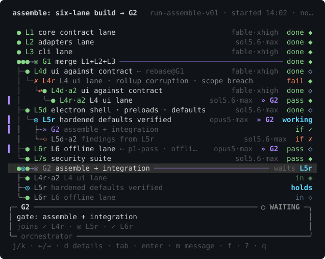

# herdr-dagr

Your agent swarm as a live DAG, in a [herdr](https://herdr.dev) pane.



> *Dagr* is the Norse personification of day: he rides across the sky once
> per cycle and illuminates everything below. Also, it's a DAG. With herdr's r.

## FAQ for humans

### What does this do?

It helps you manage and track agentic workflows involving 5+ agents or steps.

### How does it do it?

Your plan is a [DAG](https://en.wikipedia.org/wiki/Directed_acyclic_graph),
and your agents keep it current as they work. You watch it live in a pane,
and click any row to see who ran it, how long it took, and whether anyone
actually checked the result.

### What if I have more questions?

Ask your agent to read this README. Feeling lazy? Copy this prompt:

```
Read https://raw.githubusercontent.com/aemrebarut/herdr-dagr/main/README.md
and tell me what it does and whether it fits the way I run agents.
```

### No more questions, how do I get this?

```sh
herdr plugin install aemrebarut/herdr-dagr                            # prebuilt on released tags
npx skills add aemrebarut/herdr-dagr --skill dagr-producer -g         # teach your agent to feed it
```

The last command is what makes the pane useful: it installs the producer
skill, which teaches your agent to write the run file. Nothing is written
into your agent unless you run it yourself.

Then open the pane from inside herdr:

```sh
herdr plugin action invoke open-dagr --plugin herdr-dagr
# Windows preview: invoke open-dagr-windows instead
```

There is one action per side (`open-dagr-right`, `-down`, `-up`,
`-left`), so bind the one you want to a key and it always opens there:
see [Install](#install).

---

# The long version

## The pain point

You kick off a multi-agent run and lose the plot in minutes. Run state
is a JSON file or a status block, so you end up asking the orchestrator
"where are we?" and trusting the answer. You can't see which attempt is
actually running, what got sent back and why, what a gate is waiting
on, or what a retry loop is about to spawn. And when an agent says
"done", nothing tells you whether anyone checked.

## What dagr does

- **Shows the whole run at a glance.** Every task, attempt, gate, and
  loop, one line per attempt, drawn like `git log --graph`.
- **Keeps large programs legible.** Recursive project rows pair a fold caret
  with an aggregate-state node aligned to their child rail, while dependencies
  remain free to cross projects.
- **Shows what can move next.** Queued rows derive `waits ID`, `ready`,
  `unassigned`, or `needs answer` from ordinary task facts; canceled work
  stays visible without blocking the rest of the view.
- **Keeps history honest.** A retry is a new row with a recorded cause
  (who sent it back, why). Nothing moves backward or repaints.
- **Separates "the agent said done" from "verified".** Every completion
  carries an evidence tier: `◆ verified · ◇ reported · ≈ heuristic ·
  ! asserted`.
- **Shows the future, marked as future.** Work a loop policy will emit
  is drawn in dotted ink, declared by the producer, never guessed by
  the renderer.
- **Makes gates read like milestones.** A local gate stays with its project;
  a gate joining workstreams moves to their shared project or the run root,
  with a state-bearing `N→1 ⋈` join instead of hiding under one input lane.
- **Lets you steer from the pane.** One editable message goes to the
  orchestrator through Herdr. Three defaults—Use judgment, Get guidance,
  Snooze—stay flexible, and explicit authority says whether to return a
  recommendation or decide and continue.

It's terminal-native 256-color ANSI, a single Rust binary, no runtime
interpreter.

## How to use it

Install the producer skill into your agent. It teaches any agent to
write and maintain the run file:

```sh
npx skills add aemrebarut/herdr-dagr --skill dagr-producer -g
```

For an agent without a skill system, paste the file into its
instructions instead. `dagr --skill` prints the copy bundled with your
binary, and [`skills/dagr-producer/SKILL.md`](skills/dagr-producer/SKILL.md)
is the same file here. Nothing is installed into your agent unless you
run that command yourself.

Then describe what your workflow should look like: review loops,
parallel lanes, gates, whatever you want. The agent maintains the run
file, the pane picks it up live, and you can iterate on the design with
them mid-run. The [selfrun demo](demos/selfrun/) is a run file produced
exactly this way, by an agent onboarded with only the skill.

## How it works

Your orchestrator (or any agent, onboarded with the shipped
[producer skill](skills/dagr-producer/SKILL.md)) maintains `run.json`
against [`CONTRACT.md`](CONTRACT.md). `dagr` watches
the file and draws it. It never writes run state; whoever produces the
data owns it. Operator messages are journaled next to the run, then queued
to the orchestrator; dagr never becomes a second workflow engine.



The contract is the load-bearing part: it can express the task/attempt
split, recursive project scopes, dependency promotion, typed loop policies,
evidence tiers, operator-message correlation, and liveness. Anything that
wants to be drawn has to say what actually
happened, in a schema that can't blur "the agent said done" into
"done."

## The grammar in one screen

```
├─● L3 contract freeze        done ◆ verified   12m
├─✗ L4·a1 impl: gate schema   sent back        10m  builder-2  ✗ operator "err paths untested"
├↩● L4·a2 impl: gate schema   done ◇ reported   7m  builder-2
├─◎ L5 impl: renderer core    working          14m  builder-1
│ ╰┄○ L5r review              (future: on done)
├─●◎●→⋈ G2 integration gate   waits L5r
```

Gate rows carry state-bearing joins (`●◎●→⋈ G2`) in declared input order;
narrow panes collapse them to counts and then `N→1`. A gate is a project
milestone, never a child of whichever input ran last. Moving the cursor
reveals exact input ids and highlights the edges that justify the selected
row. Projects recurse through foldable aggregate-state nodes; a cross-project
dependency stays visible as `⇠` ink without duplicating the task.

If a terminal font renders `◎` unevenly, set `DAGR_WORKING_GLYPH=*` for the
single-cell ASCII working mark.

## Layout

One responsive pane, two graph grammars, with a stable selected-item inspector
at full width below the graph:

- **At ~146 columns and up** (the screenshot above): trace left and a
  compact attention queue right. lazygit's grammar.
- **Below that**: full-width trace. tig's grammar.

At either width, cursor movement updates a fixed four-line inspector without
moving the graph. Its double-line frame is deliberately distinct from graph
rails; it contains identity/state, the most useful operational signal, and
actor/timing plus `model·thinking` in the bottom border.
Press `d` for a focus-plus-context view of the selected node's
direct inputs and outputs; the complete detail body scrolls independently below
it. Press `d` or `esc` to return to the exact graph position.



Both screenshots are real renderer output, regenerable with
[`scripts/snapshot-svg.py`](scripts/snapshot-svg.py):
`dagr view samples/run.json --snapshot --width 150 --select G2 | python3 scripts/snapshot-svg.py out.svg`.

## Navigation

The basics: `j/k` move (`g/G` jump to the ends, `ctrl-d/u` half-page),
`tab` cycles the attention queue, `enter` focuses the selected
attempt's herdr pane, `d` opens its causal neighborhood and full scrollable
detail card, `m` opens the orchestrator message composer,
`r` reloads, `?` opens help, and `q` quits. In the composer, `tab` cycles
Use judgment / Get guidance / Snooze, `ctrl-t` changes authority, and all
text remains editable. An adjacent `actions.json` can replace or add a few
prompt starters without code or onboarding. Model, reasoning, and multi-agent
requests remain ordinary text.

Big runs get noisy, so the tree folds and zooms. `←` replaces the branch
under the cursor with one `▸ N items` aggregate row; it keeps blocked,
lost, review, unverified, working, queued, failed, canceled, and done counts, so folding never
buries an alarm. `→` unfolds, and on an open branch it zooms: the
subtree takes over the pane with a breadcrumb up top, and anything
outside that still needs eyes shows as a `+n need eyes outside`
counter, so zooming can't hide trouble either. `z` folds everything
that has settled, in one press. `esc` backs out of details, help, picker,
search, and zoom before it ever quits.

Finding things is quick too: `f` opens a file picker that lists your
recent runs first and scans nearby folders in the background, so
switching runs is a few keystrokes, not a filesystem crawl. `/` filters
rows by id, name, or agent as you type, `n/N` walk the matches, and `y`
copies the selected row id to your clipboard.

The mouse works too: click a trace row or a queue item to select it,
click the inspector for details, click a `▸` chip to unfold it,
double-click a row to zoom into it, scroll to move the cursor (or the open
detail card), and drag across anything to select text,
which lands on your clipboard when you let go. The message action in the
focus card is clickable; Enter remains the deliberate submission step.
Legacy v1/v2 action data remains readable but has no key binding or execution
path.

## Install

```sh
herdr plugin install aemrebarut/herdr-dagr   # checksum-verified prebuilt on released tags
herdr plugin action invoke open-dagr --plugin herdr-dagr
npx skills add aemrebarut/herdr-dagr --skill dagr-producer -g   # teach your agent to feed it
```

Released revisions download a matching binary for macOS (Apple or Intel),
Linux (x86-64 or ARM64), or Windows x86-64. The installer checks the release's
recorded commit as well as its checksum, so a normal released install needs no
Rust or Cargo. An unreleased or locally changed ref builds from source instead
of silently downloading older code.

Windows support follows Herdr's current preview boundary. Use the
`open-dagr-windows` action (or the side-specific `-down-windows`,
`-up-windows`, `-left-windows`, and `-right-windows` ids). Rendering,
navigation, folding, search, and orchestrator messages use the Windows
binary and Herdr CLI transport. Herdr's
live pane-liveness overlay and Enter-to-focus link currently use Unix sockets,
so those two conveniences are unavailable on Windows until Herdr exposes an
equivalent named-pipe link.

Or from a clone, `herdr plugin link .` at the repo root.

Installing the plugin gives you the pane. The skill is what gives you
something to draw, and it is a separate opt-in command: nothing writes
into your agent's config on your behalf. See
[How to use it](#how-to-use-it).

Bind it to a key in `~/.config/herdr/config.toml`:

```toml
[[keys.command]]
key = "prefix+d"
type = "plugin_action"
command = "herdr-dagr.open-dagr"
description = "open dagr run DAG in split"
```

That opens it to the right. Want it somewhere else? Bind
`open-dagr-down`, `open-dagr-up`, `open-dagr-left`, or
`open-dagr-right` instead, one key per side. On Windows, bind the matching
ids suffixed with `-windows` (for example, `open-dagr-right-windows`).

Or standalone, without herdr:

```sh
cargo build --release --locked
export PATH="$PWD/target/release:$PATH"   # demo docs assume dagr on PATH
export DAGR_RUN=samples/run.json
dagr view                             # interactive; --snapshot for capture
dagr check samples/run.json --strict
dagr stats samples/run.json
dagr --skill                          # the producer skill, as shipped
```

Cargo is required only when building from source.

## Repo layout

- [`CONTRACT.md`](CONTRACT.md): contract v3 (v1/v2 remain readable), including
  recursive projects, scope-correct gates, and correlated operator messages.
- [`src/`](src/): the `dagr` binary (Rust; serde + crossterm +
  unicode-width). `dagr check` lints a run file against the contract
  (`--json` for machine output, `--strict` to fail on warnings);
  `dagr view` is the pane (interactive watch mode, `--snapshot` for CI
  capture); `dagr stats` reports flow analytics (age, WIP, rework,
  critical path, naive ETA) over per-attempt timestamps.
- [`herdr-plugin.toml`](herdr-plugin.toml): the plugin manifest.
- [`samples/run.json`](samples/run.json): canonical contract v1 sample.
  [`samples/states.json`](samples/states.json): the whole state machine
  as data (every task/attempt state, all four evidence tiers), the
  renderer's regression fixture.
- [`demos/`](demos/): `selfrun/` (this repo's own development as a run
  file, produced by an agent onboarded with only the producer skill).
- [`skills/dagr-producer/`](skills/dagr-producer/SKILL.md): the skill
  that teaches any agent to set up and maintain a run graph against the
  contract, looping on `dagr check` for feedback. Install it with
  `npx skills add aemrebarut/herdr-dagr --skill dagr-producer -g`, or
  print the bundled copy with `dagr --skill`. Its `examples/` are held
  strict-clean by the test suite.
- [`assets/`](assets/): the README screenshots, generated from
  `samples/run.json` by [`scripts/snapshot-svg.py`](scripts/snapshot-svg.py).

## Status

**v0.3.1.** Long graphs now scroll inside their own vertical region;
selected-item detail and command hints remain docked regardless of graph
length. Mouse targets, text selection, page navigation, modal prompts, and
extremely tall wrapped detail share the same height-aware layout.

**v0.3.0.** Contract v3 makes the editable message composer the sole action
path while v1/v2 files remain readable with legacy action data inert. Each
submission records its run, task, revision, starter, authority, and exact text
before one addressed Herdr delivery.
The release includes checksum-verified standalone binaries for macOS
(Apple or Intel), Linux (x86-64 or ARM64), and Windows x86-64, with Cargo
needed only for source-build fallback. Contract, model, renderer,
interaction, installer, and width-regression tests cover the shipped paths.

## License

Licensed under either of [Apache License, Version 2.0](LICENSE-APACHE)
or [MIT license](LICENSE-MIT) at your option. Unless you explicitly
state otherwise, any contribution intentionally submitted for inclusion
in this work by you, as defined in the Apache-2.0 license, shall be
dual-licensed as above, without any additional terms or conditions.
